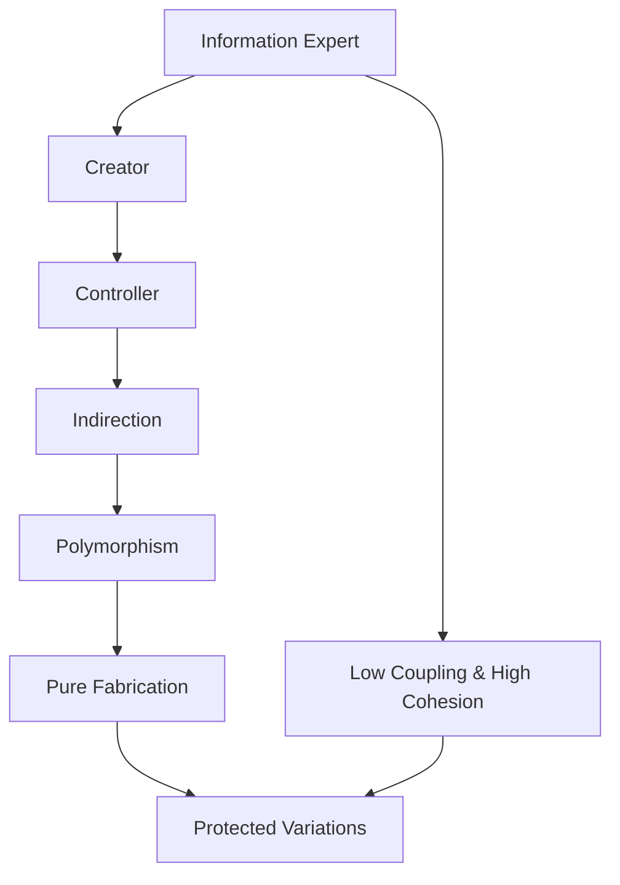

# 📚 Принципы GRASP с адаптацией для JavaScript и Node.js

> **Конспект лекции о принципах распределения ответственности в программном обеспечении**

## 🎯 Введение

**GRASP** (General Responsibility Assignment Software Patterns) — это набор из **9 принципов** распределения ответственности в программном обеспечении. Они также называются шаблонами, но смысл их немного отличается от классических шаблонов проектирования "банды четырых" (Gang of Four).

### 💡 Об этом курсе

Принципы GRASP пришли из объектно-ориентированного программирования, но их можно применять и в других парадигмах. В данном курсе мы адаптируем эти принципы для **JavaScript** и **Node.js**.

### 📖 Историческая справка

Принципы GRASP были впервые предложены **Крэгом Ларманом** (Craig Larman) в книге _"Applying UML and Patterns: An Introduction to Object-Oriented Analysis and Design"_.

> **💡 Важное замечание:** Даже если вы никогда не слышали о GRASP, вы, вероятно, уже применяли эти принципы интуитивно. Это систематизированный опыт, который Крэг Ларман формализовал и описал.

### 📋 Список из 9 принципов GRASP

| № | Принцип | Название на русском | Основная задача |
|---|---------|---------------------|-----------------|
| 1 | **Information Expert** | Информационный эксперт | Распределение ответственности |
| 2 | **Creator** | Создатель | Управление созданием объектов |
| 3 | **Low Coupling** | Низкое зацепление | Минимизация зависимостей |
| 4 | **High Cohesion** | Высокая связность | Усиление внутренней связи |
| 5 | **Controller** | Контроллер | Изоляция бизнес-логики |
| 6 | **Polymorphism** | Полиморфизм | Замена условий наследованием |
| 7 | **Indirection** | Посредник | Снижение прямых зависимостей |
| 8 | **Pure Fabrication** | Чистая выдумка | Системные абстракции |
| 9 | **Protected Variations** | Защита от изменений | Устойчивость к изменениям |

### 🔗 Взаимосвязь принципов

Все принципы GRASP тесно связаны друг с другом:

- **Low Coupling** ↔️ **High Cohesion** — составляют пару, улучшение одного приводит к улучшению другого
- **Protected Variations** — результат применения всех остальных принципов
- Все принципы дополняют друг друга и работают в связке

---

## 1️⃣ Information Expert (Информационный эксперт)

> **Базовый принцип GRASP** — основа распределения ответственности

### 📝 Определение

**Information Expert** — принцип, согласно которому ответственность должна быть назначена тому классу (или программному компоненту), который имеет всю необходимую информацию для выполнения операции или принятия решения.

### ❓ Проблема, которую решает

Как распределить ответственность между программными компонентами:

- ✅ Классами
- ✅ Модулями
- ✅ Функциями
- ✅ Любыми программными абстракциями (акторами, сервисами, подсистемами)

### 💡 Решение

> **Назначить ответственность тому классу, который имеет всю необходимую информацию для работы — для принятия решения или выполнения операции.**

Эта формулировка пришла из **кибернетики**: решения в кибернетических системах управления принимаются именно в том месте иерархии, где есть **полнота информации** для принятия решения.

### ✨ Зачем применяется

| Преимущество | Описание |
|--------------|----------|
| **⬇️ Снижает зацепление** | Уменьшает связность между компонентами |
| **🎯 Упрощает код** | Делает логику более понятной |
| **🔒 Повышает инкапсуляцию** | Скрывает внутренние детали реализации |
| **♻️ Усиливает переиспользование** | Компоненты легче использовать повторно |

### Где встречается

У программного компонента (класса, модуля) есть:
- **Внутренние поля** и методы (защищенные, приватные)
- **Внешний интерфейс** (публичные методы и свойства)

Программная абстракция сама управляет своими внутренними данными. Взаимодействие с ней должно происходить **только через внешний интерфейс**.

> Не лезьте классу "в душу" — работайте через его публичный API!

### Связь с законом Деметры

**Закон Деметры** (принцип "не говорите с незнакомцами") тесно связан с Information Expert.

**Нарушение** выглядит так:

```javascript
// Плохо: цепочки вызовов, нарушение закона Деметры
instance.someProperty.anotherProperty.deepProperty.doSomething();
```

Здесь мы "идем в чужие дебри" по ссылкам, изучаем недокументированные структуры данных и нарушаем инкапсуляцию.

**Правильный подход**:

```javascript
// Хорошо: работа через интерфейс
instance.doSomething();
```

Нужно общаться только с ближайшими соседями, знать их интерфейс и не проникать в детали реализации.

### Проблемы в JavaScript

JavaScript — гибкий и динамичный язык, что создает особые проблемы:

#### 1. Динамическая модификация объектов

```javascript
// Модификация на лету
object.newProperty = "value";
delete object.existingProperty;
object.method = function() { /* новая реализация */ };
```

Если это делается **извне класса** (внешним кодом), это приводит к:
- Нарушению консистентности
- Появлению множества `if`-проверок
- Усложнению кода

#### 2. Примеси (mixins)

Примеси широко распространены в JavaScript, но они **мешают реализации GRASP** принципов.

#### 3. Последствия динамизма

Если форма объектов модифицируется, в коде появляются проверки:

```javascript
// Плохо: везде проверки из-за динамической модификации
if (object.hasOwnProperty('method')) {
  if (typeof object.method === 'function') {
    object.method();
  }
}
```

Это приводит к **усложнению кода** везде, где используются инстансы класса.

### Современные возможности JavaScript

В современном JavaScript есть средства для инкапсуляции:

```javascript
class MyClass {
  #privateField;  // Приватное поле (через #)
  _protectedField; // Условное защищенное поле (через _)

  constructor() {
    this.#privateField = 'secret';
  }

  publicMethod() {
    // Публичный метод
  }
}
```

### 🎯 Ключевые выводы

> **Information Expert — базовое, основное понятие в GRASP**

- ✅ Каждый компонент управляет своей информацией сам
- ✅ Работайте через интерфейсы, не нарушайте инкапсуляцию
- ✅ Избегайте динамической модификации объектов извне
- ✅ Используйте приватные поля (`#`) для скрытия деталей реализации

---

## 2️⃣ Creator (Создатель)

> **Управление жизненным циклом объектов**

### 📝 Определение

**Creator** — принцип, определяющий, кто должен быть ответственным за создание (инстанцирование) объектов или программных компонентов.

### ❓ Проблема, которую решает

Кто должен отвечать за:

- 🏗️ Инстанцирование классов
- 📦 Загрузку программных абстракций
- ⚙️ Инициализацию компонентов
- 💾 Наполнение данными
- 🚀 Запуск компонентов

### 📐 Правила создания

Крэг Ларман предлагает несколько правил для определения создателя:

#### 1. Агрегация и композиция

Если один класс **агрегирует** или **композирует** другие классы (использует их как внутренние поля), то он может их и инстанцировать.

```javascript
class Car {
  constructor() {
    // Car создает Engine, так как композирует его
    this.engine = new Engine();

    // Или принимает через аргументы
    // this.engine = engine;
  }
}
```

#### 2. Интенсивная работа

Инстанцировать следует там, где идет **интенсивная работа** с объектом:
- Чтение и изменение свойств
- Вызов методов
- Подписка на события

Компонент, который интенсивно работает с объектом, должен:
- Его инстанцировать
- Держать на него ссылки

#### 3. Инициализация и хранение

Создавать объект должен тот компонент, который может:
- **Наполнить его информацией** (проинициализировать)
- **Хранить множество инстансов** в коллекции
- Заниматься их **переиспользованием** (например, пулы объектов)

### Примеры использования

Creator реализуется через:

1. **Конструкторы классов**
   ```javascript
   class Order {
     constructor() {
       this.items = [];  // Order создает массив
       this.customer = new Customer();  // Order создает Customer
     }
   }
   ```

2. **Фабрики** (Factory Pattern)
   ```javascript
   class UserFactory {
     static create(type) {
       if (type === 'admin') return new AdminUser();
       if (type === 'regular') return new RegularUser();
     }
   }
   ```

3. **Пулы объектов** (Object Pools)
   ```javascript
   class ConnectionPool {
     constructor(size) {
       this.connections = [];
       for (let i = 0; i < size; i++) {
         this.connections.push(new Connection());
       }
     }
   }
   ```

### Управление жизненным циклом

**Важный принцип**: Тот, кто создает — тот и управляет жизненным циклом.

#### В языках с Garbage Collection (JavaScript, Node.js)

```javascript
class Manager {
  constructor() {
    this.resource = new Resource();  // Создали
  }

  cleanup() {
    this.resource = null;  // Потеряли ссылку — GC уничтожит
  }
}
```

Как только ссылки потеряны, **Garbage Collector** автоматически освободит память.

#### Управление ресурсами

Не все ресурсы — это только память. Классы могут создавать:
- Сетевые соединения (connections)
- Файловые дескрипторы
- Таймеры
- Подписки на события

```javascript
class FileManager {
  constructor(filename) {
    this.fd = fs.openSync(filename, 'r');  // Открыли дескриптор
  }

  close() {
    fs.closeSync(this.fd);  // Закрыли дескриптор
  }
}
```

### Зачем применяется

Применение Creator:
- **Снижает зацепление**
- **Избегает утечек памяти** и ресурсов
- Делает **ответственность явной**

### Универсальность принципа

Creator актуален не только для ООП, но и для **процедурного программирования**:

> Где выделилась память, там она должна быть и освобождена.

---

## 3️⃣ Low Coupling & High Cohesion (Низкое зацепление и высокая связность)

> **Пара взаимосвязанных принципов структуры зависимостей**

### 📝 Определение

**Low Coupling** (Низкое зацепление) и **High Cohesion** (Высокая связность) — это пара взаимосвязанных принципов, которые описывают структуру зависимостей между программными компонентами.

### Цель

Нужно добиться такой архитектуры, где:
- **Внутри** модуля/класса компоненты **сильно связаны** (high cohesion)
- **Между** модулями/классами зависимости **минимальны** (low coupling)

### High Cohesion (Высокая связность)

**Внутри программного компонента** элементы тесно связаны:

```javascript
// Модуль с высокой связностью
class OrderProcessor {
  validateOrder(order) { /* ... */ }
  calculateTotal(order) { /* ... */ }
  applyDiscounts(order) { /* ... */ }

  // Все методы работают с order — высокая связность
}
```

Характеристики:
- Несколько классов/функций внутри модуля
- Много обращений друг к другу
- Хорошее знание интерфейсов друг друга
- Совместная работа над общей задачей

### Low Coupling (Низкое зацепление)

**Между программными компонентами** связей должно быть мало:

```javascript
// Низкое зацепление через интерфейс
class OrderService {
  constructor(paymentGateway) {
    this.paymentGateway = paymentGateway;  // Зависимость через интерфейс
  }

  processOrder(order) {
    // Работаем только через публичный API
    this.paymentGateway.charge(order.total);
  }
}
```

Способы снижения зацепления:

#### 1. Фасад (Facade)

Две подсистемы общаются через фасад, скрывающий сложность:

```javascript
class PaymentFacade {
  charge(amount) {
    // Скрывает сложную логику работы с платежными системами
  }
}
```

#### 2. Экспорт интерфейсов (Module exports)

```javascript
// module.js - экспортируем только публичный API
module.exports = {
  publicMethod1,
  publicMethod2
};

// Внутренние функции не экспортируются
function internalHelper() { }
```

#### 3. Публичные и приватные члены

В TypeScript:

```typescript
class MyClass {
  public publicMethod() { }     // Доступен извне
  private internalMethod() { }  // Только внутри класса
  protected protectedMethod() { } // Для наследников
}
```

### Взаимосвязь принципов

**Low Coupling** и **High Cohesion** — это две стороны одной медали:

> Если соблюдается Information Expert → автоматически улучшается Coupling/Cohesion

### Ключевые выводы

- **Внутри** модуля — сильная связность
- **Между** модулями — слабое зацепление
- Используйте публичные интерфейсы для взаимодействия
- Скрывайте внутренние детали реализации

---

## 4️⃣ Controller (Контроллер)

> **Изоляция бизнес-логики от внешнего мира**

### 📝 Определение

**Controller** — принцип изоляции внутренней бизнес-логики от внешних воздействий (пользовательского интерфейса, ввода-вывода, сети).

### Проблема, которую решает

В систему поступают запросы из разных источников:
- **Асинхронно** (особенно важно для Node.js)
- **Параллельно** (несколько запросов одновременно)
- Из разных источников (сеть, UI, события, таймеры)

Бизнес-логика предполагает **последовательное выполнение**, а асинхронность **сильно усложняет** ее написание.

### Решение

Controller **экранирует** поток внешних событий от бизнес-логики:

```
[События] → [Controller] → [Линейная бизнес-логика]
```

После контроллера выполнение бизнес-логики должно быть **максимально линейным**.

### Зачем применяется

Controller обеспечивает защиту от:

1. **Потока событий**
   - События приходят хаотично
   - Контроллер упорядочивает их обработку

2. **Асинхронности**
   - В JavaScript — асинхронное исполнение
   - В других языках — еще и параллельное (многопоточность)

3. **Race Conditions (состояние гонки)**
   - Предотвращает проблемы с одновременным доступом
   - Изолирует бизнес-логику от конкурентности

### Ответственности контроллера

Controller берет на себя **системные задачи**:

- Сериализация и десериализация
- Валидация входных данных
- Маршрутизация запросов
- Преобразование форматов
- Управление потоком выполнения

### Примеры использования

#### 1. Фасад (Facade)

```javascript
class OrderController {
  async createOrder(req, res) {
    // Контроллер изолирует HTTP от бизнес-логики
    const orderData = req.body;

    // Вызов бизнес-логики
    const order = await orderService.create(orderData);

    res.json(order);
  }
}
```

#### 2. Изоляция слоев (Layered Architecture)

```
[Presentation Layer]
       ↓
[Controller Layer]  ← Контроллер изолирует слои
       ↓
[Business Logic Layer]
       ↓
[Data Layer]
```

#### 3. Паттерн Command

```javascript
class CommandController {
  constructor() {
    this.commands = new Map();
  }

  register(name, command) {
    this.commands.set(name, command);
  }

  execute(name, ...args) {
    const command = this.commands.get(name);
    return command.execute(...args);
  }
}
```

### Особенности для Node.js

В Node.js контроллер особенно важен из-за:
- Event Loop — все асинхронно
- Одновременная обработка множества запросов
- Callbacks, Promises, async/await — нужна изоляция от этой сложности

```javascript
// Контроллер скрывает асинхронность
class UserController {
  async getUser(req, res) {
    try {
      // Бизнес-логика не знает об HTTP и асинхронности
      const user = await userService.findById(req.params.id);
      res.json(user);
    } catch (error) {
      res.status(500).json({ error: error.message });
    }
  }
}
```

### Ключевые выводы

- Controller отделяет бизнес-логику от UI/IO
- Защищает от асинхронности и событийного потока
- Делает бизнес-логику линейной и понятной
- В Node.js особенно актуален из-за асинхронной природы платформы

---

## 5️⃣ Polymorphism (Полиморфизм)

> **Замена условий наследованием**

### 📝 Определение

**Polymorphism** — принцип использования полиморфизма для замены условных операторов (`if`/`case`) на наследование и динамическую диспетчеризацию.

### Проблема, которую решает

Когда в коде накапливается большое количество условий, которые ветвят поведение в зависимости от типа:

```javascript
// Плохо: множество условий
function processPayment(payment) {
  if (payment.type === 'credit_card') {
    // Логика для кредитной карты
  } else if (payment.type === 'paypal') {
    // Логика для PayPal
  } else if (payment.type === 'crypto') {
    // Логика для криптовалюты
  }
  // ... еще 10 вариантов
}
```

Проблемы:
- Метод **разрастается**
- Сложно **добавлять новые типы**
- Нарушается принцип **единственной ответственности**

### Решение

Вместо `if`/`case` используем **полиморфизм**:

```javascript
// Абстрактный класс/интерфейс
class PaymentMethod {
  process(amount) {
    throw new Error('Must be implemented');
  }
}

// Конкретные реализации
class CreditCardPayment extends PaymentMethod {
  process(amount) {
    // Логика для кредитной карты
  }
}

class PayPalPayment extends PaymentMethod {
  process(amount) {
    // Логика для PayPal
  }
}

// Использование
function processPayment(paymentMethod, amount) {
  // Одинаковый вызов, разное поведение
  paymentMethod.process(amount);
}
```

### Принцип работы

1. Создаем **абстрактную сущность** (интерфейс, абстрактный класс)
2. Создаем **несколько наследников** с разной реализацией
3. Работаем через **общий интерфейс**
4. Поведение определяется **типом объекта**, а не условиями

### Преимущества

**Наследование заменяет условия:**

| До (условия)                    | После (полиморфизм)           |
|---------------------------------|-------------------------------|
| Один большой метод с `if`/`case`| Много маленьких классов       |
| Сложно добавить новый тип       | Легко — просто новый класс    |
| Нарушение Open/Closed           | Соблюдение Open/Closed        |

### Связь с SOLID

Polymorphism тесно связан с принципами SOLID:

#### 1. Open/Closed Principle (Открыт для расширения, закрыт для модификации)

```javascript
// Добавление нового типа не требует изменения существующего кода
class CryptoPayment extends PaymentMethod {
  process(amount) {
    // Новая реализация
  }
}
```

Мы **расширили** систему, но **не изменили** существующий код.

#### 2. Liskov Substitution Principle (Принцип подстановки Барбары Лисков)

```javascript
function checkout(paymentMethod) {
  // Любой наследник PaymentMethod можно подставить
  paymentMethod.process(100);  // Одинаковый интерфейс
}

// Все работает одинаково
checkout(new CreditCardPayment());
checkout(new PayPalPayment());
checkout(new CryptoPayment());
```

Любой наследник может быть **безопасно подставлен** вместо родителя.

### Пример с коллекциями

```javascript
// Абстрактный интерфейс коллекции
class Collection {
  get length() { throw new Error('Must be implemented'); }
  [Symbol.iterator]() { throw new Error('Must be implemented'); }
}

// Коллекция в памяти
class ArrayCollection extends Collection {
  constructor(items) {
    super();
    this.items = items;
  }

  get length() {
    return this.items.length;
  }

  *[Symbol.iterator]() {
    for (const item of this.items) {
      yield item;
    }
  }
}

// Коллекция с ленивой загрузкой из БД
class DatabaseCollection extends Collection {
  constructor(query) {
    super();
    this.query = query;
    this.cachedLength = null;
  }

  get length() {
    if (!this.cachedLength) {
      // Загружаем только длину
      this.cachedLength = db.count(this.query);
    }
    return this.cachedLength;
  }

  async *[Symbol.iterator]() {
    // Ленивая загрузка по частям
    const cursor = db.find(this.query);
    for await (const item of cursor) {
      yield item;
    }
  }
}

// Использование — интерфейс одинаковый
function printLength(collection) {
  console.log(collection.length);  // Реализация разная!
}
```

### Когда применять

Используйте полиморфизм, когда:
- В коде много **`if`/`case`** по типам
- Есть **иерархия типов** с общим поведением
- Нужно **легко расширять** систему новыми типами
- Хотите соблюдать **Open/Closed** принцип

### Ключевые выводы

- Полиморфизм **заменяет условия** наследованием
- Упрощает добавление новых типов
- Связан с Open/Closed и Liskov Substitution из SOLID
- Работаем через интерфейс, реализация определяется типом

---

## 6️⃣ Indirection (Посредник)

> **Снижение зацепления через объект-посредник**

### 📝 Определение

**Indirection** — принцип снижения зацепления между компонентами путем введения **объекта-посредника**.

### Проблема, которую решает

Два компонента напрямую зависят друг от друга, что создает:
- Высокое зацепление (coupling)
- Сложность переиспользования
- Жесткую связь между компонентами

### Решение

Вводим **посредника**, который:
- Знает об обоих компонентах
- Координирует их взаимодействие
- Снижает их зависимость друг от друга

```
До:  [A] ←→ [B]  (высокое зацепление)

После: [A] ← [Посредник] → [B]  (низкое зацепление)
```

### Примеры реализации

#### 1. Паттерн Mediator (Посредник)

```javascript
// Посредник координирует взаимодействие
class ChatMediator {
  constructor() {
    this.users = [];
  }

  register(user) {
    this.users.push(user);
    user.mediator = this;
  }

  send(message, from, to) {
    // Посредник управляет коммуникацией
    to.receive(message, from);
  }
}

class User {
  constructor(name) {
    this.name = name;
  }

  send(message, to) {
    // Отправка через посредника
    this.mediator.send(message, this, to);
  }

  receive(message, from) {
    console.log(`${this.name} received: ${message} from ${from.name}`);
  }
}
```

#### 2. MVC Controller (Контроллер из MVC)

```javascript
// View не знает о Model, Model не знает о View
class TodoController {
  constructor(model, view) {
    this.model = model;
    this.view = view;

    // Controller знает об обоих
    this.view.on('add-todo', (text) => {
      this.model.addTodo(text);
    });

    this.model.on('change', () => {
      this.view.render(this.model.getTodos());
    });
  }
}
```

#### 3. Event-based коммуникация (События)

```javascript
// Компоненты общаются через события
class EventBus {
  constructor() {
    this.listeners = new Map();
  }

  on(event, handler) {
    if (!this.listeners.has(event)) {
      this.listeners.set(event, []);
    }
    this.listeners.get(event).push(handler);
  }

  emit(event, data) {
    const handlers = this.listeners.get(event) || [];
    handlers.forEach(handler => handler(data));
  }
}

// Компонент A не знает о компоненте B
class ComponentA {
  constructor(eventBus) {
    this.eventBus = eventBus;
  }

  doSomething() {
    this.eventBus.emit('data-changed', { value: 42 });
  }
}

class ComponentB {
  constructor(eventBus) {
    this.eventBus = eventBus;
    this.eventBus.on('data-changed', this.handleChange.bind(this));
  }

  handleChange(data) {
    console.log('Received:', data);
  }
}
```

### Зачем применяется

Indirection обеспечивает:

1. **Снижение зацепления**
   - Компоненты не зависят напрямую друг от друга
   - Изменение одного не влияет на другой

2. **Улучшение переиспользования**
   - Компоненты можно использовать независимо
   - Легко заменить одну часть системы

3. **Упрощение тестирования**
   - Можно тестировать компоненты изолированно
   - Легко создавать mock-объекты

### Пример: абстрагирование UI компонентов

```javascript
// Кнопка не знает о бизнес-логике покупок
class Button {
  constructor(label) {
    this.label = label;
    this.clickHandlers = [];
  }

  onClick(handler) {
    this.clickHandlers.push(handler);
  }

  click() {
    this.clickHandlers.forEach(h => h());
  }
}

// Контроллер связывает кнопку с бизнес-логикой
class CheckoutController {
  constructor(button, orderService) {
    this.button = button;
    this.orderService = orderService;

    // Контроллер знает о бизнес-логике и UI
    this.button.onClick(() => {
      this.orderService.checkout();
    });
  }
}
```

Кнопка **переиспользуется** в разных контекстах, потому что не привязана к конкретной логике.

### Ключевые выводы

- Indirection вводит посредника между компонентами
- Снижает зацепление, улучшает переиспользование
- Примеры: Mediator, MVC Controller, Events
- Компоненты не знают друг о друге напрямую

---

## 7️⃣ Pure Fabrication (Чистая выдумка)

> **Системные абстракции вне предметной области**

### 📝 Определение

**Pure Fabrication** — принцип создания абстракций, которых нет в моделируемой предметной области. Это системные, машинно-ориентированные абстракции, специфичные для платформы.

### Что это такое

Абстракции, которые:
- **Не существуют** в реальной предметной области
- **Машинно-ориентированные** (технические)
- Относятся к **особенностям платформы**
- Являются **инженерной выдумкой**

### Примеры Pure Fabrication

#### 1. Iterator (Итератор)

```javascript
// Iterator — чистая выдумка программиста
const array = [1, 2, 3];
const iterator = array[Symbol.iterator]();

iterator.next(); // { value: 1, done: false }
iterator.next(); // { value: 2, done: false }
```

В предметной области итераторов нет — это техническая абстракция для удобства.

#### 2. Promise (Промис)

```javascript
// Promise — системная абстракция для асинхронности
const promise = new Promise((resolve, reject) => {
  setTimeout(() => resolve('done'), 1000);
});

promise.then(result => console.log(result));
```

Промисы — это наша **выдумка** для управления асинхронным кодом.

#### 3. Коллекции и структуры данных

```javascript
// LinkedList, Queue, Set — чистая выдумка
class LinkedList {
  constructor() {
    this.head = null;
    this.tail = null;
  }

  append(value) { /* ... */ }
  remove(value) { /* ... */ }
}
```

В предметной области нет "двусвязных списков" — это техническая абстракция.

#### 4. События и обработчики ошибок

```javascript
// Ошибки — системная абстракция
try {
  throw new Error('Something went wrong');
} catch (error) {
  console.error(error.message);
}

// EventEmitter — чистая выдумка
emitter.on('event', handler);
emitter.emit('event', data);
```

### Системные абстракции в Node.js

В Node.js много примеров Pure Fabrication:

```javascript
// Файловый дескриптор — системная абстракция
const fd = fs.openSync('file.txt', 'r');

// Stream — техническая абстракция
const stream = fs.createReadStream('file.txt');

// Buffer — низкоуровневая абстракция
const buffer = Buffer.from('hello');

// Connection Pool — выдумка для управления ресурсами
const pool = new ConnectionPool(10);
```

### Зачем применяется

Pure Fabrication обеспечивает:

1. **Переиспользование кода**
   - Системные абстракции работают в любой предметной области
   - Не нужно реализовывать заново

2. **Уменьшение кода в бизнес-логике**
   - Технические детали скрыты в системных абстракциях
   - Бизнес-код становится чище и понятнее

3. **Разделение ответственности**
   - Бизнес-логика отделена от технических деталей
   - Классы предметной области меньше зацеплены

### Пример: async/await vs callbacks

```javascript
// На колбэках — много технических деталей в бизнес-логике
function processOrder(orderId, callback) {
  db.findOrder(orderId, (err, order) => {
    if (err) return callback(err);

    payment.charge(order.total, (err, result) => {
      if (err) return callback(err);

      shipping.send(order, (err, tracking) => {
        if (err) return callback(err);
        callback(null, tracking);
      });
    });
  });
}

// На async/await — бизнес-логика чище
async function processOrder(orderId) {
  const order = await db.findOrder(orderId);
  const result = await payment.charge(order.total);
  const tracking = await shipping.send(order);
  return tracking;
}
```

**Pure Fabrication** (async/await) убирает технические детали из бизнес-логики.

### Встроенные vs самописные абстракции

Используйте **встроенные** системные абстракции:
- Promise, Iterator, Set, Map — уже есть в JavaScript
- Stream, Buffer, EventEmitter — уже есть в Node.js

Не нужно реализовывать заново, если есть готовое решение в платформе.

### Ключевые выводы

- Pure Fabrication — абстракции вне предметной области
- Это технические, системные абстракции
- Примеры: Iterator, Promise, Stream, Error
- Уменьшают код в бизнес-логике
- Переиспользуются в любых проектах

---

## 8️⃣ Protected Variations (Защита от изменений)

> **Устойчивость к изменениям через стабильные интерфейсы**

### 📝 Определение

**Protected Variations** — принцип защиты от изменений путем взаимодействия через стабильные интерфейсы и контракты.

Это одновременно:
- **Результат** применения всех предыдущих принципов GRASP
- **Способ** достижения устойчивости к изменениям

### Проблема, которую решает

Код должен быть **устойчив к изменениям**:
- Изменения в одном компоненте не должны ломать другие
- Внутренние изменения не должны влиять на внешний API
- Нужна возможность развивать систему без поломок

### Решение

Взаимодействие между компонентами через:

1. **Спецификацию интерфейсов**
2. **Контрактное программирование**
3. **Семантическое версионирование**

```javascript
// Контракт — стабильный интерфейс
interface PaymentGateway {
  charge(amount: number): Promise<PaymentResult>;
  refund(transactionId: string): Promise<void>;
}

// Реализация может меняться
class StripeGateway implements PaymentGateway {
  async charge(amount: number) {
    // Детали реализации могут меняться
    // Но интерфейс остается стабильным
  }
}
```

### Контрактное программирование

**Контракт** определяет:
- Что компонент **принимает** (входные параметры)
- Что компонент **возвращает** (результат)
- Какие **гарантии** он дает (инварианты)

```typescript
/**
 * Вычисляет сумму заказа
 * @param items - массив товаров (не пустой)
 * @returns сумма >= 0
 */
function calculateTotal(items: Item[]): number {
  // Контракт гарантирует результат >= 0
  return items.reduce((sum, item) => sum + item.price, 0);
}
```

Пользователь работает с **контрактом**, а не с реализацией.

### Семантическое версионирование (SemVer)

**SemVer** — формат версий: `MAJOR.MINOR.PATCH`

```
1.2.3
│ │ └─ PATCH: исправления багов (обратно совместимы)
│ └─── MINOR: новые функции (обратно совместимы)
└───── MAJOR: breaking changes (несовместимые изменения)
```

#### Что означает каждая часть

| Версия изменилась | Что произошло                    | Нужен ли рефакторинг? |
|-------------------|----------------------------------|-----------------------|
| `1.0.0 → 1.0.1`   | Исправлены баги                  | Нет                   |
| `1.0.0 → 1.1.0`   | Добавлены новые функции          | Нет                   |
| `1.0.0 → 2.0.0`   | Breaking changes, API изменился  | **Да**                |

#### Когда увеличивать версию

```javascript
// PATCH (1.0.0 → 1.0.1): исправление бага
function add(a, b) {
  return a + b;  // Было: return a - b (баг)
}

// MINOR (1.0.0 → 1.1.0): новая функция
function multiply(a, b) {
  return a * b;  // Новая функция, старые работают
}

// MAJOR (1.0.0 → 2.0.0): breaking change
function add(numbers) {  // Было: add(a, b)
  return numbers.reduce((sum, n) => sum + n, 0);
}
```

### Связь с Open/Closed Principle

**SemVer** коррелирует с **Open/Closed Principle** из SOLID:

| Принцип          | Версия  | Описание                                |
|------------------|---------|-----------------------------------------|
| Open (расширяем) | MINOR ↑ | Добавили функции, старые работают       |
| Closed (закрыт)  | PATCH ↑ | Внутренние изменения, интерфейс тот же  |
| Нарушили закрытость | MAJOR ↑ | Изменили интерфейс (breaking change) |

```javascript
// Соблюдение Open/Closed → MINOR версия
class PaymentGateway {
  charge(amount) { /* ... */ }

  // Добавили новый метод, старые не изменились
  chargeBatch(amounts) { /* ... */ }  // MINOR: 1.0.0 → 1.1.0
}

// Нарушение Open/Closed → MAJOR версия
class PaymentGateway {
  // Изменили сигнатуру метода
  charge(request) { /* ... */ }  // Было: charge(amount)
  // MAJOR: 1.0.0 → 2.0.0
}
```

### Когда мы устойчивы к изменениям

Устойчивость достигается когда:

1. **Правильная нумерация версий** (SemVer)
   - Понятно, какие изменения breaking, какие нет
   - Пользователи знают, нужен ли им рефакторинг

2. **Соблюдение всех GRASP принципов**
   - Information Expert → четкое распределение ответственности
   - Low Coupling → изменения локализованы
   - High Cohesion → связанное меняется вместе

3. **Описание контрактов**
   - TypeScript типы (.d.ts файлы)
   - JSDoc комментарии
   - Четкая спецификация exports

```typescript
// Контракт через TypeScript
export interface UserService {
  findById(id: string): Promise<User | null>;
  create(data: UserData): Promise<User>;
}

// Версия в package.json
{
  "name": "user-service",
  "version": "1.2.3",  // SemVer
  "types": "index.d.ts"  // Типы
}
```

### Пример: изменения без поломок

```javascript
// Версия 1.0.0 — исходный интерфейс
class Database {
  find(query) {
    return this.collection.find(query);
  }
}

// Версия 1.1.0 — добавили опции (обратно совместимо)
class Database {
  find(query, options = {}) {
    // Старый код работает: find(query)
    // Новый код может: find(query, { limit: 10 })
    return this.collection.find(query, options);
  }
}

// Версия 2.0.0 — изменили интерфейс (breaking)
class Database {
  find(options) {  // Теперь query внутри options
    return this.collection.find(options.query, options);
  }
}
```

### Ключевые выводы

- Protected Variations — результат применения всех GRASP принципов
- Используйте SemVer для версионирования
- Работайте через интерфейсы и контракты
- MAJOR версия ↑ когда ломаете обратную совместимость
- MINOR версия ↑ когда добавляете функции
- PATCH версия ↑ когда исправляете баги

---

## 🎓 Заключение

### 🔗 Взаимосвязь всех принципов

Все 9 принципов GRASP тесно связаны друг с другом:



**Текстовая схема:**
```
Information Expert ←→ Low Coupling & High Cohesion
        ↓
    Creator
        ↓
   Controller ←→ Indirection
        ↓
  Polymorphism
        ↓
 Pure Fabrication
        ↓
Protected Variations (результат применения всех принципов)
```

### 💡 Ключевые идеи

| № | Принцип | Главная идея |
|---|---------|--------------|
| 1️⃣ | **Information Expert** | Основа всего — распределение ответственности по информации |
| 2️⃣ | **Creator** | Управление жизненным циклом объектов |
| 3️⃣ | **Low Coupling & High Cohesion** | Структура зависимостей |
| 4️⃣ | **Controller** | Изоляция бизнес-логики от внешнего мира |
| 5️⃣ | **Polymorphism** | Замена условий на полиморфизм |
| 6️⃣ | **Indirection** | Снижение зацепления через посредников |
| 7️⃣ | **Pure Fabrication** | Системные абстракции вне предметной области |
| 8️⃣ | **Protected Variations** | Устойчивость к изменениям |

### 🌐 Применение в JavaScript и Node.js

Хотя GRASP пришел из ООП, его принципы применимы и в JavaScript:

| Концепция ООП | Альтернатива в JavaScript |
|---------------|---------------------------|
| **Классы** | Модули, функции |
| **Инкапсуляция** | Closures, приватные поля (`#`) |
| **Связь между объектами** | Events, callbacks |
| **Управление асинхронностью** | Promises, async/await (Pure Fabrication) |
| **Изоляция компонентов** | Module pattern, ES6 modules |

### 🔄 Связь с другими принципами

GRASP дополняет и пересекается с:

- ✅ **SOLID** принципы (особенно Open/Closed, Liskov Substitution)
- ✅ **Закон Деметры** (Law of Demeter) — тесно связан с Information Expert
- ✅ **DRY** (Don't Repeat Yourself)
- ✅ **KISS** (Keep It Simple, Stupid)
- ✅ **YAGNI** (You Aren't Gonna Need It)

### 🛠️ Практическое применение

Используйте GRASP для:

| Сценарий | Применение |
|----------|------------|
| 🏗️ **Проектирование** | Планирование архитектуры с самого начала |
| 🔧 **Рефакторинг** | Улучшение существующего кода |
| 👁️ **Code Review** | Проверка качества и структуры кода |
| 📚 **Обучение** | Обучение команды лучшим практикам |

### 🚀 Следующие шаги

В следующих лекциях будут рассмотрены:

- ✅ Детальные примеры каждого принципа с реальным кодом
- ✅ Production-код на JavaScript и Node.js
- ✅ Антипаттерны и их решение через GRASP
- ✅ Комбинирование принципов в реальных проектах

---

## 📚 Дополнительные ресурсы

### 📖 Рекомендуемая литература

| Автор | Книга | Описание |
|-------|-------|----------|
| **Craig Larman** | "Applying UML and Patterns" | Оригинальная книга о GRASP принципах |
| **Robert Martin** | "Clean Code" | Чистый код и лучшие практики |
| **Martin Fowler** | "Refactoring" | Рефакторинг существующего кода |
| **Eric Evans** | "Domain-Driven Design" | Проектирование на основе предметной области |

### 🔗 Связанные темы для изучения

- 🎯 **Шаблоны проектирования GoF** (Gang of Four) — 23 классических паттерна
- 🎯 **SOLID принципы** — 5 принципов объектно-ориентированного дизайна
- 🎯 **Domain-Driven Design (DDD)** — проектирование, ориентированное на предметную область
- 🎯 **Clean Architecture** — чистая архитектура по Роберту Мартину
- 🎯 **Microservices Patterns** — паттерны микросервисной архитектуры

---

> **✨ Конец конспекта лекции**
> _Создано на основе лекции о GRASP принципах с адаптацией для JavaScript и Node.js_
